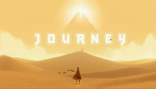

  

## About The Project
Fake3D effect based on Threejs.  

## Reference
Tutorial https://github.com/akella/fake3d  
The depth map is generated by https://3dphoto.io/uploader/ 

## License
This project is licensed under 

## Contact
* Email:[eric199002@icloud.com](eric199002@icloud.com)
* Twitter:[https://twitter.com/nikoniko600](https://twitter.com/nikoniko600)
<!-- * Repo:[https://github.com/Eric-Schecter/music-visualizer](https://github.com/Eric-Schecter/music-visualizer)
* App:[https://music-visualizer-project.netlify.app](https://music-visualizer-project.netlify.app)  -->